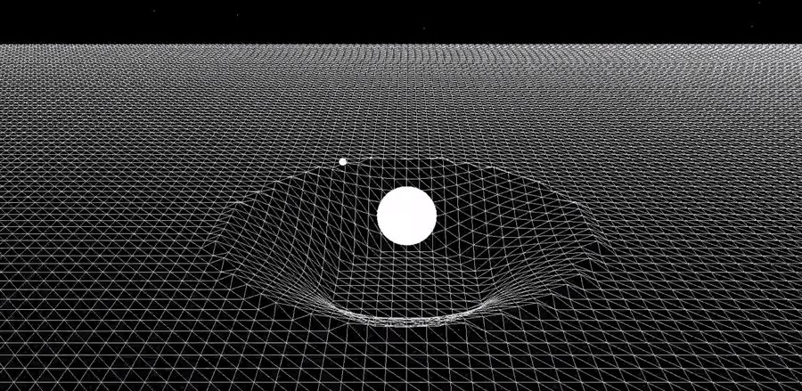

# spacetime-curvature

Interactive 3D visualization of how massive objects bend spacetime.

A planet sits on a deformable grid (representing the spacetime fabric) and warps it with its mass. A satellite orbits along the curved surface — the heavier the planet, the deeper the curvature.

## Controls

- **`=` / `+`** — increase planet mass
- **`-`** — decrease planet mass
- **Hold Shift** — faster mass change
- **Esc** — quit

## How it works

- 200×200 deformable grid rendered in real-time
- Grid vertices displaced by distance from the massive object (inverse-square-style falloff, clamped)
- Satellite follows a fixed orbital radius at the sphere's settled height
- Background star field for depth
- Raw OpenGL — no engine, no physics library

## Stack

`C++` · `OpenGL` · `GLEW` · `GLFW`

## Build

Open `spacetime-curvature.sln` in Visual Studio 2022, build and run (x64). Requires GLEW and GLFW. Library paths in the `.vcxproj` point to `C:\IT\glfw-3.4.bin.WIN64` and `C:\IT\glew-2.1.0` — adjust them to your install locations.
